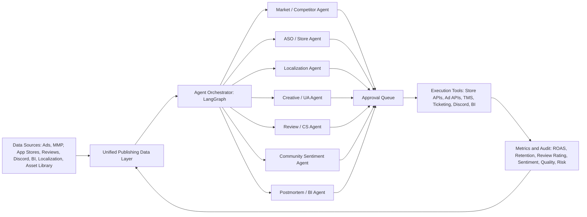

# 吉比特海外发行：端到端 AI 发行流程可行性、竞品与开源参考调研

日期：2026-06-19  
对象：吉比特深圳游戏 AI 产品经理面试准备  
问题：VP 提出“海外发行的所有工作都可以用 AI 来执行”，是否可行？市面上是否已有竞品？是否有开源参考？

## 0. 结论先行

我的判断是：这个方向成立，但必须重新定义。

更准确的说法不是“AI 无人接管海外发行”，而是：

> 海外发行的大多数执行动作都可以被 AI 编排和执行；但市场判断、品牌表达、预算、合规、版权、玩家权益和危机处理必须保留人审、权限边界和审计。

所以，VP 想要的“端到端 AI 海外发行流程”可以做，但产品形态应该是：

> AI Overseas Publishing Cockpit / AI 海外发行驾驶舱：把市场情报、竞品监控、ASO、本地化、素材、买量、评论客服、社群舆情、版本运营、数据复盘接成一个带人审闸口的工作流系统。

不是做一个单纯聊天机器人，也不是做一个“自动改预算、自动发素材、自动回玩家、自动上架”的黑箱 agent。

市场上目前没有发现成熟的、游戏海外发行专用的、自助式端到端 AI publishing OS。现在的市场是模块化的：

- UA/广告平台已经高度 AI 化：Google App Campaigns、Meta Advantage+、AppLovin AXON、Moloco、TikTok Smart+。
- 游戏创意和素材方向开始出现垂直 AI：Reforged Labs Boa、Layer、Segwise、Alison.ai。
- ASO/评论方向有较强 AI agent：AppTweak Atlas AI、AppFollow。
- 本地化、客服、社群、BI 各有成熟工具：Lokalise、Phrase、Crowdin、Helpshift、Zendesk、Sprinklr、Metabase 等。
- 最接近“端到端”的是 CAS.AI、Arcade、Supersonic 这类 mobile game publisher/service-platform，但它们是发行服务/平台，不是可交给内部发行团队自助配置的 AI OS。

这反而说明：吉比特如果想做，机会不在底层大模型，而在“游戏海外发行领域流程 + 数据接口 + 审批治理 + 指标闭环”。

## 1. 本次调研方法

本次按 workspace 的 `workflow_deep_research_survey` 标准流程做：

1. 初步扫描：拆解 VP 命题、海外发行链路、已有工具分布。
2. Claim extraction：把“所有工作都能用 AI 执行”拆成可验证命题。
3. 多 agent 并行：
   - 可行性与系统架构
   - 商业竞品
   - 开源技术栈
   - 风险、反证和人审边界
4. 交叉验证：用公开来源验证竞品能力、平台 API、开源项目和风险案例。
5. 写入统一调研报告。

配套工件：

- `tmp/ai_overseas_publishing_e2e_20260619/search_manifest.md`
- `tmp/ai_overseas_publishing_e2e_20260619/source_index.md`
- `tmp/ai_overseas_publishing_e2e_20260619/subagent_outputs.md`

## 2. 先定义“端到端 AI 发行”

这里必须先拆概念。否则“所有工作都用 AI 执行”很容易变成一句无法落地的口号。

| 等级 | 含义 | 适用场景 |
|---|---|---|
| L0 人工 | 人手动做，AI 不参与 | 高度模糊、强关系、强责任场景 |
| L1 Copilot | AI 生成草稿、摘要、建议，人执行 | PR 稿初稿、素材 brief、复盘初稿 |
| L2 Workflow | 固定流程自动化，关键点人确认 | 周报生成、版本 checklist、翻译流转 |
| L3 Supervised Agent | Agent 可调用工具跨系统执行，但需审批、日志、回滚 | ASO 实验草案、广告计划草案、客服分流 |
| L4 Autonomous Closed-loop | AI 读取数据、决策、执行、评估、迭代 | 低风险 FAQ、监控告警、低预算素材测试 |

面试里建议这样说：

> 我会把 VP 的端到端拆成 L1 到 L4。低风险、高频、可回滚、指标清楚的动作可以做到 L4；预算、外发、玩家权益、合规、版权和危机处理只能做到 L2/L3，必须有人审。

## 3. 海外发行全流程与 AI 可行性

| 环节 | 典型业务内容 | AI 可执行内容 | 可行等级 | 必须人审的边界 |
|---|---|---|---:|---|
| 市场研究 | 选国家、看品类、用户画像、竞品格局 | 抓榜单、商店页、评论、广告素材、社媒讨论，生成国家/品类洞察 | L3 | 是否进入市场、投入规模、战略优先级 |
| 竞品分析 | 竞品版本、素材、商店页、KOL、社区反馈 | 监控竞品动态、素材拆解、评论主题、版本节奏 | L3 | 第三方下载/流水估算不能当真实数据 |
| 产品定位 | 卖点、用户分层、题材表达、商业化叙事 | 生成卖点矩阵、差异化表达、文化适配风险 | L2-L3 | 核心定位、商业化模型、品牌调性 |
| 本地化 | 翻译、术语库、商店文本、公告、客服话术 | 初译、术语一致性、UI 长度检查、LQA 问题分类 | L2-L3 | 剧情语气、文化敏感、概率/福利/充值文案 |
| 商店页/ASO | 标题、副标题、关键词、截图、视频、A/B 测试 | 关键词建议、页面文案、截图脚本、实验设计 | L3 | 上架提交、品牌表达、平台政策 |
| 素材创意 | UA 视频、图片、短视频脚本、UGC、分镜、多语言改版 | brief、脚本、分镜、字幕、变体、素材标签、素材复盘 | L2-L3 | 版权、角色一致性、平台广告政策、文化误读 |
| 买量投放 | 建 campaign、预算、出价、国家、受众、素材测试 | 生成投放草案、日报、预算建议、低效素材预警 | L2-L3，局部 L4 | 大预算调整、跨区域扩量、优化目标切换 |
| KOL/PR | KOL 筛选、brief、报价、排期、PR 稿、媒体沟通 | KOL 初筛、brief 初稿、报价表整理、进度跟踪 | L1-L2 | 谈判、合同、品牌风险、代言/IP 合作 |
| 社群运营 | Discord、Reddit、Facebook、X、活动、公告、舆情 | 舆情监控、FAQ、活动草稿、违规预警、情绪聚类 | L2-L3 | 争议回应、补偿承诺、封禁争议 |
| 客服/评论 | App Store/Google Play 评论、工单、退款、账号问题 | 评论聚类、回复建议、工单分流、已知问题自动回复 | L3，低风险 L4 | 退款、封号、充值、账号安全、投诉升级 |
| 版本运营 | 上线 checklist、公告、LQA、问题分派、风险提醒 | 自动检查、公告初稿、测试问题汇总、风险预警 | L2-L3 | 是否上线、补偿策略、活动奖励、商业化改动 |
| 数据复盘 | ROAS、留存、LTV、素材表现、ASO 转化、评论主题 | 自动归因、周报、素材胜负手、异常预警、复盘初稿 | L3 | 因果判断、是否扩量、是否改产品 |
| 预算/合规 | 预算分配、隐私、概率披露、素材授权、地区政策 | 预算模拟、合规 checklist、敏感词/概率/隐私提醒 | L1-L2 | 法务、财务、合规、负责人最终确认 |

一句话总结：

> 海外发行可以做到“流程端到端”，但不能做到“责任端到端交给 AI”。

## 4. 竞品调研：没有完整 OS，但模块很成熟

### 4.1 最接近端到端的游戏发行平台

| 类型 | 代表 | 能力 | 对吉比特的启发 | 局限 |
|---|---|---|---|---|
| Mobile game publisher / service-platform | [CAS.AI](https://cas.ai/)、[CAS.AI Publishing](https://cas.ai/publishing/) | UA、ASO、创意、变现、数据分析、发行服务 | 说明游戏发行可以平台化、流程化、数据化 | 这是合作发行团队，不是内部 AI OS |
| Data-first publisher | [Arcade](https://arcade.com/news/arcade.com-launches-as-a-data-first-mobile-game-publisher-for-casual-and-hybrid-casual-studios) | 数据化发行、performance marketing infrastructure、开发者合作 | 说明“发行基础设施 + 执行团队”的模式正在强化 | 更偏 casual/hybrid-casual，不是通用发行 agent |
| Hyper/hybrid-casual publishing | [Supersonic](https://supersonic.com/) | UA、变现、素材、数据化产品建议 | 发行链路成熟参考 | 不是 AI agent 产品，且平台战略稳定性需持续核验 |

结论：这类公司证明“发行可以被拆成可复用流程”，但它们不是 VP 想象的内部端到端 AI 工具。

### 4.2 UA/买量：自动化最成熟，但黑箱最明显

| 产品 | 能力 | 能学什么 |
|---|---|---|
| [Google App Campaigns](https://support.google.com/google-ads/answer/6247380?hl=en) | 自动组合素材、自动优化投放，广告主提供文本、bid、预算、语言和地区 | 买量天然适合数据闭环和自动优化 |
| [Meta Advantage+ App Campaigns](https://www.facebook.com/business/ads/meta-advantage-plus/app-campaigns) | 自动受众、版位、创意增强、预算分配 | 自动化带来效率，但控制权下降 |
| [AppLovin AXON AI](https://legal.applovin.com/about-applovins-axon-ai/) | 按 advertiser return goals 评估 impression 价值并出价 | AI 可以优化 ROAS，但平台内部逻辑黑箱 |
| [Moloco Ads](https://www.moloco.com/solutions/moloco-ads) | 基于一方数据和 MMP postback 优化高价值用户获取 | 强依赖数据质量和归因 |
| [TikTok API for Business](https://ads.tiktok.com/help/article/marketing-api?lang=en) / Smart+ | 自动化广告操作和 app promotion | 适合短视频素材测试和区域拉新 |

启发：UA 是最适合 AI 的环节，但不能只看平台 ROAS。必须用 MMP、服务端收入、留存、退款、LTV、geo holdout 或增量实验交叉验证。

### 4.3 游戏创意与素材：最像 AI 产品经理的突破口

| 产品 | 能力 | 对岗位的启发 |
|---|---|---|
| [Reforged Labs Boa](https://reforgedlabs.com/) | 面向 mobile game marketers 的 creative intelligence，回答什么广告有效、为什么有效、下一步做什么 | 这是游戏垂直 AI 的强参考：从素材数据到下一轮 brief |
| [Layer AI for Mobile Games](https://www.layer.ai/industries/mobile-games) | 帮 mobile game studios 扩大 art、UA creatives、LiveOps content 生产 | 素材生成要和品牌资产、活动节奏、UA 数据接起来 |
| Segwise / Alison.ai | 素材标签、创意疲劳、跨广告网络分析 | 证明“素材语义标签 + 投放表现”是关键数据模型 |
| Creatify / Arcads / AdCreative.ai | 泛视频广告生成 | 可做工具参考，但游戏垂直语义不足 |

启发：不要只讲“AI 生成素材”。更高级的说法是：

> 把竞品素材、历史素材、投放表现和玩家反馈转成下一轮创意 brief，并让 AI 生成候选素材，再用投放数据回流评估。

### 4.4 ASO、评论与商店页：AI agent 已经出现

| 产品 | 能力 | 启发 |
|---|---|---|
| [AppTweak Atlas AI](https://www.apptweak.com/en/atlas-ai) / [AI Agents](https://www.apptweak.com/en/ai-agents-aso-apple-ads) | ASO Agent、Ad Agent、Reviews Agent、Reporting Agent；接入真实关键词、评论、campaign 和表现数据 | “领域数据 + agent”比通用 ChatGPT 更有价值 |
| [AppFollow](https://appfollow.io/) | AI review management、语义标签、多语言评论回复、人工介入复杂问题 | 评论/客服是高频、低风险、可度量场景 |
| [Google Play Custom Store Listings](https://support.google.com/googleplay/android-developer/answer/9867158?hl=en) | 可按用户/国家/渠道定制商店页 | AI 可以生成分地区分渠道页面草案 |
| [Apple Custom Product Pages](https://developer.apple.com/app-store/custom-product-pages/) / [Product Page Optimization](https://developer.apple.com/app-store/product-page-optimization/) | 自定义产品页与 A/B 测试 | 适合形成“素材-投放-商店页”的实验闭环 |

启发：ASO 是连接 UA 和自然量的关键环节。AI 可以做关键词、文案、截图、review insight，但提交审核和品牌表达必须人审。

### 4.5 本地化、客服、社群：成熟但分散

| 类型 | 产品 | 能力 | 启发 |
|---|---|---|---|
| 本地化 | [Lokalise](https://lokalise.com/)、Phrase、Crowdin、Smartling | 翻译记忆、术语库、AI 翻译、工作流、SDK/API | AI 本地化必须接术语库和人工审校 |
| 玩家客服 | [Helpshift](https://www.helpshift.com/)、Zendesk AI | 游戏客服、玩家支持、自动分流、AI agent | 低风险 FAQ 可自动，高风险权益类必须升级 |
| 舆情社媒 | Sprinklr、Brandwatch、Hootsuite | social listening、社媒排期、舆情分析 | 社群是 prompt injection 和品牌风险高发区 |

启发：这些不是发行 AI OS，但都是可以接入 AI 海外发行驾驶舱的模块。

## 5. 开源参考：可以拼出 MVP，但生产要补治理

推荐原型技术栈：

| 模块 | 开源参考 | 用法 | 风险 |
|---|---|---|---|
| Agent 编排 | [LangGraph](https://github.com/langchain-ai/langgraph)、[LangGraph Docs](https://docs.langchain.com/oss/python/langgraph/overview) | 做发行任务状态机、人审、长流程恢复 | 工程门槛高，需要自己做 UI/权限/审计 |
| 工作流集成 | [n8n](https://github.com/n8n-io/n8n) | 接 Slack/飞书/Discord/表格/API/webhook/定时任务 | 注意许可证和代码节点安全 |
| 快速原型 | [Dify](https://github.com/langgenius/dify)、[Flowise](https://github.com/FlowiseAI/Flowise) | 快速演示 RAG、agent flow、工具调用 | 生产不要公网裸奔，注意密钥和工具权限 |
| 数据接入 | [Airbyte](https://github.com/airbytehq/airbyte)、[Meltano](https://github.com/meltano/meltano) | 拉广告、商店、MMP、BI、客服数据 | 连接器质量和账号权限要管 |
| 本地化 | [Weblate](https://github.com/WeblateOrg/weblate)、[Tolgee](https://github.com/tolgee/tolgee-platform)、[LibreTranslate](https://github.com/LibreTranslate/LibreTranslate) | 术语库、翻译管理、自动翻译 baseline | AI 初译不能替代 LQA |
| 素材生成 | [ComfyUI](https://github.com/comfyanonymous/ComfyUI)、InvokeAI、Stable Diffusion WebUI、Wan video workflows | 可复用视觉工作流、批量变体生成 | 版权、风格一致性、GPU 和审核 |
| 分析/实验 | [PostHog](https://github.com/posthog/posthog)、[GrowthBook](https://github.com/growthbook/growthbook) | 漏斗、留存、实验、feature flags | 依赖埋点和统计设计 |
| BI 看板 | [Metabase](https://github.com/metabase/metabase)、[Superset](https://github.com/apache/superset) | 发行日报、素材表现、渠道 ROI、评论主题 | 指标口径要统一 |
| LLM 观测/评测 | [Langfuse](https://github.com/langfuse/langfuse)、[Promptfoo](https://github.com/promptfoo/promptfoo) | trace、成本、质量评测、red team | 要建立真实业务测试集 |

推荐 MVP 架构：

关键产品原则：

1. 默认 read-only：先让 AI 会看、会总结、会建议。
2. 写操作走审批：广告预算、商店页、外发内容、客服回复进入人审队列。
3. 工具权限分级：只给 agent 它需要的最小权限。
4. 所有动作留痕：输入、模型、提示词版本、输出、人工修改、发布人、结果指标都留存。
5. 指标回流：不是只看“生成了多少”，而是看人审通过率、返工率、CTR/CVR/CPI/ROAS、留存、评分、投诉率。

## 6. 风险边界：为什么不能直接无人化

### 6.1 广告平台黑箱和素材跑偏

广告平台 AI 已经很强，但它们也暴露出控制权减少、自动生成素材不透明、自动扩展设置难发现等问题。公开报道中，Meta AI creative 曾出现异常素材被投放的案例。这个风险在游戏发行里更敏感，因为素材可能涉及角色、玩法、概率、福利、误导性承诺和文化误读。

参考：[Business Insider Meta AI ads case](https://www.businessinsider.com/meta-ai-generating-bizarre-ads-advantage-plus-2025-10)、[Google Final URL expansion](https://support.google.com/google-ads/answer/14337539)。

### 6.2 AI 对外回复的责任仍由公司承担

Air Canada chatbot 案例说明：公司不能因为“是 AI 说的”而免除责任。对于游戏发行，退款、封号、充值、活动补偿、概率、账号安全、未成年人、地区政策都不能让 AI 自动承诺。

参考：[Air Canada chatbot liability](https://www.americanbar.org/groups/business_law/resources/business-law-today/2024-february/bc-tribunal-confirms-companies-remain-liable-information-provided-ai-chatbot/)、[DPD chatbot incident](https://time.com/6564726/ai-chatbot-dpd-curses-criticizes-company/)。

### 6.3 平台 ROAS 不等于真实增量

iOS SKAN 延迟、coarse/null conversion value、平台 modeled conversion、MMP 去重、自然量 cannibalization 都会影响判断。AI 可以优化平台目标，但不能把平台目标等同公司真实目标。

发行 AI 系统至少要分三层指标：

1. 平台层：CTR、CVR、CPI、platform ROAS。
2. 游戏层：D1/D3/D7 留存、付费率、ARPU、LTV、退款率、回收周期。
3. 增量层：geo holdout、incremental ROAS、自然量影响、重激活占比。

### 6.4 开源 agent/workflow 有安全面

n8n、Flowise、LangChain/LangGraph 生态能提升效率，但如果直接接广告账户、素材库、客服系统和内部 BI，权限过大就会变成生产风险。OWASP LLM Top 10 里提到 prompt injection、sensitive information disclosure、insecure plugin design、excessive agency、overreliance，这些都正好对应发行 agent。

参考：[OWASP LLM Top 10](https://owasp.org/www-project-top-10-for-large-language-model-applications/)、[n8n security advisory](https://github.com/advisories/GHSA-v98v-ff95-f3cp)、[Flowise advisory](https://github.com/FlowiseAI/Flowise/security/advisories/GHSA-99pg-hqvx-r4gf)。

### 6.5 平台政策、隐私和概率披露必须机制化

海外发行常见硬边界：

- Google Play data safety 要求声明数据收集与处理方式：[Google Play Data safety](https://support.google.com/googleplay/android-developer/answer/10787469?hl=en)
- Apple 对抽卡/随机道具概率披露有要求：[Apple App Review Guidelines](https://developer.apple.com/app-store/review/guidelines/)
- 面向儿童或可能触达儿童的产品要考虑 COPPA 等规则：[FTC COPPA](https://www.ftc.gov/legal-library/browse/rules/childrens-online-privacy-protection-rule-coppa)

所以，合规不是提示词里写一句“请不要违规”，而是要进产品机制：规则库、敏感词、审核队列、授权记录、发布留痕。

## 7. 建议给吉比特的产品方案

### 7.1 产品定位

建议定义为：

> 面向海外发行团队的 AI workflow cockpit，把发行链路里的数据、内容、任务和审批接起来，让 AI 执行低风险动作、生成中高风险动作草案、沉淀案例和复盘。

核心不是替代某个发行同学，而是减少发行团队跨系统、跨语言、跨时区、跨渠道协作的损耗。

### 7.2 第一阶段 MVP：不要从“全自动发行”开始

我建议 MVP 从三个方向选一个或组合：

#### MVP A：多语言用户反馈到研发/发行闭环

适合吉比特，因为海外发行很依赖跨语言反馈和版本优化。

流程：

1. 拉取 App Store、Google Play、Discord、Reddit、客服工单、社媒评论。
2. AI 做语言识别、翻译、主题聚类、情绪判断、地区差异。
3. 自动输出 Top 问题、证据链接、影响范围、版本关联。
4. 生成研发/发行需求单草稿。
5. 跟踪处理状态和下个版本反馈是否下降。

指标：

- 评论/工单处理时效
- Top 问题发现提前量
- 重复问题占比下降
- 人审通过率
- 评分和负面情绪变化

优点：风险低，能体现“发行全流程需求识别 + AI 落地 + 效果评估”，非常贴 JD。

#### MVP B：创意洞察到素材 brief 到投放复盘闭环

流程：

1. 接入历史素材、投放数据、竞品素材库、市场热点。
2. AI 给素材打标签：玩法、情绪、卖点、节奏、角色、CTA、国家、语言。
3. 找出高表现素材的共性和疲劳信号。
4. 生成下一轮 brief 和多语言脚本。
5. 人审后生成素材候选，再进入低预算测试。
6. 投放表现回流到素材知识库。

指标：

- brief 到上线耗时
- 素材产出量
- 人审通过率
- 首轮 CTR/CVR
- 有效素材率
- CPI/ROAS 改善

优点：离收入近，VP 容易感知价值。

#### MVP C：ASO/商店页实验助手

流程：

1. 拉取关键词排名、商店转化、评论主题、竞品页面。
2. AI 生成国家/渠道差异化 store listing 草案。
3. 对应 Google Play Custom Store Listings 和 Apple Custom Product Pages。
4. 人审后提交实验。
5. 复盘转化率、下载、评分和评论变化。

指标：

- 页面实验数量
- 商店页 CVR
- 自然量
- 关键词覆盖/排名
- 页面文案返工率

优点：范围清楚，平台本身支持实验，适合证明“AI + 流程 + 数据闭环”。

### 7.3 三阶段路线图

| 阶段 | 目标 | 关键交付 | 成功指标 |
|---|---|---|---|
| 0-30 天 | 梳理流程和数据 | 发行流程地图、系统清单、数据源清单、风险分级、Top 3 MVP 场景 | 找到 1 个高频高痛低风险场景 |
| 31-60 天 | MVP 上线 | 反馈洞察/创意 brief/ASO 助手其中一个闭环；人审队列；基础看板 | 使用率、人审通过率、节省工时、返工率 |
| 61-90 天 | 扩展为 cockpit | 接入第二/第三场景；指标回流；案例库；SOP；培训机制 | 交付周期下降、问题发现提前、有效素材率或 CVR 改善 |

## 8. 指标体系：面试里一定要讲

AI 发行产品不能只讲“提效”，要能评估落地效果。建议四层指标：

| 指标层 | 指标 |
|---|---|
| 使用率 | WAU/MAU、发行团队覆盖率、流程调用次数、场景渗透率 |
| 效率 | brief 到投放耗时、周报耗时、评论处理耗时、翻译流转时间、版本 checklist 完成时间 |
| 质量 | 人审通过率、返工率、事实错误率、术语一致性、素材拒审率、客服升级率 |
| 业务 | CTR、CVR、CPI、D1/D7 留存、ROAS、LTV、商店页 CVR、评分、负面情绪、有效素材率 |
| 风险 | 异常花费、负面舆情 spike、版权投诉、policy rejection、误回复、权限越权、被拦截工具调用 |

一句话：

> AI 落地效果不能只看生成量，要看“采纳率、通过率、节省时间、业务结果和风险事件”。

## 9. 测试题预测与准备

基于 JD 和二面 VP 的观点，测试题大概率不是让你写技术方案，而是让你判断一个发行场景怎么用 AI 落地。

可能题型：

### 题型 1：设计一个 AI 海外发行全流程方案

题目可能长这样：

> 如果给你《一念逍遥》或某款吉比特产品的海外发行任务，请设计一个端到端 AI 发行流程，说明覆盖哪些环节、如何接入数据、如何评估效果、哪些环节需要人审。

答题结构：

1. 先定义目标：不是无人化，是 AI workflow。
2. 拆链路：市场研究、ASO、本地化、素材、UA、社群、客服、版本、复盘。
3. 选 MVP：用户反馈闭环 / 创意 UA 闭环 / ASO 实验助手。
4. 画流程：数据源 -> agent -> 人审 -> 执行 -> 指标回流。
5. 讲指标：效率、质量、业务、风险。
6. 讲边界：预算、外发、合规、版权、玩家权益必须人审。

### 题型 2：判断 VP 的“所有工作 AI 执行”是否可行

建议回答：

> 我认为方向成立，但要按风险等级拆。高频、低风险、可回滚、指标清楚的动作可以自动执行，比如评论聚类、日报、素材标签、低风险 FAQ、低预算素材测试。中风险动作，比如 ASO 文案、素材 brief、投放计划，可以由 AI 生成草案，人审后执行。高风险动作，比如预算扩量、对外公告、玩家补偿、封号解释、概率和隐私表述，不能无人化，必须保留 owner 审批和审计。

### 题型 3：选择一个 AI 落地场景并做 MVP

最稳的选择：多语言用户反馈到研发/发行闭环。

为什么稳：

- 贴合 JD 的“搜集并分析发行全流程业务需求”
- 风险比自动投放低
- 数据源容易讲：商店评论、客服、社群、社媒
- 指标容易讲：时效、聚类准确率、人审通过率、问题闭环周期、评分/情绪变化
- 能连接研发、发行、客服、本地化多个部门，体现跨部门推进能力

可以这样写：

> 我会优先做“海外用户反馈洞察 Agent”。它每天拉取 App Store、Google Play、Discord、客服工单和社媒反馈，自动翻译、聚类、情绪识别，并按地区、版本、问题类型输出 Top issue。AI 生成需求单草稿和建议 owner，人审后进入研发/发行任务池。后续用问题处理周期、重复问题下降、评分变化、人审通过率和团队使用率评估效果。

### 题型 4：竞品调研和差异化

建议回答：

> 市面上没有完整的 AI game overseas publishing OS。现有产品分散在几个模块：UA 有 Google、Meta、AppLovin、Moloco；创意有 Reforged、Layer、Segwise；ASO 有 AppTweak、AppFollow；本地化有 Lokalise、Phrase、Crowdin；客服有 Helpshift、Zendesk。吉比特的机会是把这些分散能力用自己的发行流程、项目知识库、素材库、用户反馈和指标体系接起来，做内部 AI 发行驾驶舱。

### 题型 5：风险控制设计

建议回答：

> 我会把 agent 默认设为 read-only。所有写操作走审批队列。广告预算、素材发布、商店页提交、玩家权益回复、社群公告、隐私和概率相关文案属于高风险动作，必须人工审批。系统要有权限分级、预算硬上限、外发白名单、敏感数据脱敏、secret broker、审计日志和 kill switch。

## 10. 面试可直接使用的 8 句话

1. 我同意端到端是方向，但我会把它定义成端到端 AI workflow，而不是端到端无人决策。
2. AI 负责速度、覆盖和证据，人负责目标、边界和问责。
3. 海外发行最适合先做 AI 的不是炫技生成，而是高频、跨语言、跨系统、可度量的流程。
4. 低风险动作可以自动执行，中风险动作 AI 出草案人审，高风险动作必须 owner 审批。
5. 市场上没有成熟的游戏海外发行 AI OS，现有能力分散在 UA、创意、ASO、本地化、客服和 BI。
6. 吉比特的机会是把发行流程、项目知识库、数据接口和审批治理沉淀成内部 AI cockpit。
7. AI 落地效果不能只看生成量，要看采纳率、通过率、节省时间、业务结果和风险事件。
8. 我会优先用用户反馈闭环或创意 UA 闭环做 MVP，因为这两个场景数据反馈快、跨部门价值明显，也能沉淀案例库和 SOP。

## 11. 给 VP 的高质量回应版本

如果 VP 再说“我觉得海外发行所有工作都可以用 AI 执行”，可以这样接：

> 我认可这个方向，而且我觉得海外发行确实是 AI 很适合切的场景，因为它天然跨语言、跨地区、跨渠道、跨系统，很多动作高频重复、数据反馈快。但我不会把它理解成让 AI 无人接管整个发行，而是做一个端到端 AI workflow。AI 先把市场、素材、ASO、投放、评论、社群和复盘都接起来，自动生成候选方案、自动跑低风险流程、自动给证据和预警；预算、外发、玩家权益、版权和合规这些高风险点保留人审。这样既能吃到 AI 的效率，也不会把品牌和商业风险交给黑箱。

如果要再进一步：

> 我会先从一个低风险但高价值的闭环做 MVP，比如海外用户反馈洞察或创意 UA 闭环。先证明 AI 能减少跨语言信息损耗、缩短响应周期、提升素材/ASO/投放复盘效率，再逐步扩展成发行驾驶舱。

## 12. 最终判断

1. 可行性：可行，但必须定义成“AI 执行流 + 人审治理”，不是无人自动发行。
2. 竞品：没有完整同类产品；有大量模块化竞品，尤其 UA、创意、ASO、评论和本地化。
3. 开源：可以拼出 MVP；生产化要接官方 API、广告平台、MMP、内部 BI、素材库、审批和审计。
4. 吉比特岗位机会：AI 产品经理最有价值的地方是识别发行流程中可 AI 化的节点，设计 SOP、权限、人审、指标和案例库，让 AI 从“单点工具”变成“发行团队工作流”。

